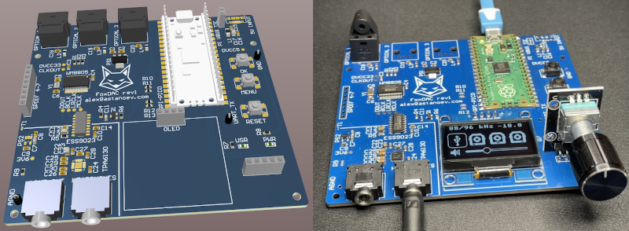

# FoxDAC - a USB / TOSLINK Audio DAC



## Features
* Built around the Raspberry Pi Pico, running @ 192MHz (48/96kHz) or ~176.6MHz (44.1kHz)
* Up to 16 bit / 96kHz audio support over USB
* LVGL-based UI with an SSD1306 OLED display and rotary encoder
* Cirrus WM8805 S/PDIF transceiver for TOSLINK reception as I2S master
* 3x TORX147 TOSLINK optical inputs
* USB audio gets sent as S/PDIF to the WM8805 for clock de-jitter
* TI TPA6130 headphone amplifier with I2C volume control
* ESS9023 DAC powered from TI LP2985 LDO
* Optional biquad equalizer running on both cores

## Compiling

```
git clone https://github.com/raspberrypi/pico-sdk.git
mkdir build
cmake -B ./build -DCMAKE_BUILD_TYPE=Release -DPICO_EXTRAS_PATH=./firmware/pico-extras/ -DPICO_SDK_PATH=./pico-sdk/ firmware/
cmake --build ./build --config Release
cp build/foxdac/foxdac.uf2 /path/to/RPI-RP2
```
